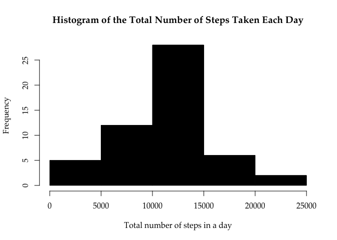
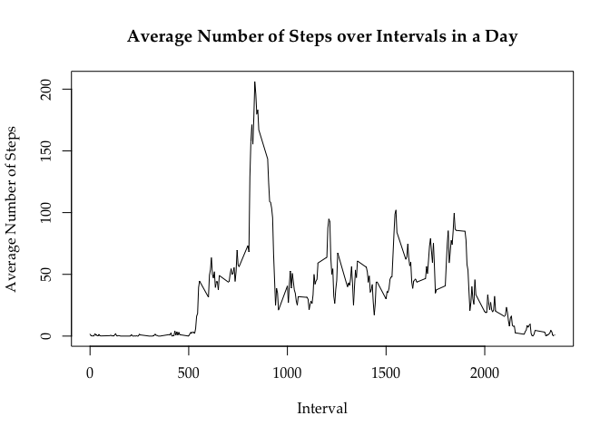
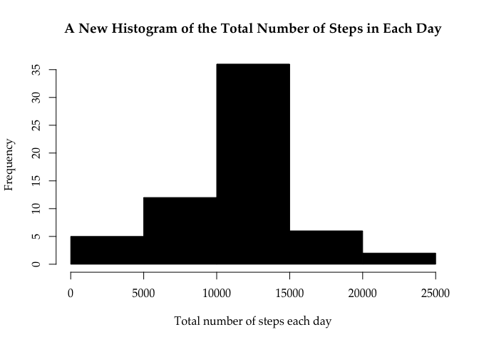
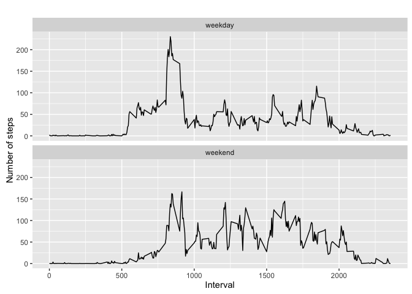

# Reproducible Research: Peer Assessment 1
Rui Qiu  
2016-07-31  

## Loading and preprocessing the data


```r
library(ggplot2)
```

```
## Warning: package 'ggplot2' was built under R version 3.2.4
```

```r
unzip("activity.zip")
df <- read.csv("activity.csv")
```

## What is mean total number of steps taken per day?
For this part of the assignment, you can ignore the missing values in the dataset.

1. Make a histogram of the total number of steps taken each day


```r
df2 <- na.omit(df)
total_steps_date <- aggregate(steps ~ date, df2, sum)
hist(total_steps_date$steps, col=1, main="Histogram of the Total Number of Steps Taken Each Day", xlab="Total number of steps in a day",family="Palatino")
```

\

2. Calculate and report the mean and median total number of steps taken per day

Mean total number of steps taken per day:

```r
mean(total_steps_date$steps)
```

```
## [1] 10766.19
```

Median total number of steps taken per day:

```r
median(total_steps_date$steps)
```

```
## [1] 10765
```

## What is the average daily activity pattern?
1. Make a time series plot (i.e. `type = "l"`) of the 5-minute interval (x-axis) and the average number of steps taken, averaged across all days (y-axis)


```r
total_steps_interval <- aggregate(steps ~ interval, df2, mean)
plot(total_steps_interval$interval, total_steps_interval$steps, type='l', col=1, main="Average Number of Steps over Intervals in a Day", xlab="Interval", ylab="Average Number of Steps", family="Palatino")
```

\

2. Which 5-minute interval, on average across all the days in the dataset, contains the maximum number of steps?


```r
total_steps_interval[which.max(total_steps_interval$steps),]
```

```
##     interval    steps
## 104      835 206.1698
```

## Imputing missing values
Note that there are a number of days/intervals where there are missing values (coded as `NA`). The presence of missing days may introduce bias into some calculations or summaries of the data.

1. Calculate and report the total number of missing values in the dataset (i.e. the total number of rows with `NA`s)


```r
df3 <- df[!complete.cases(df),]
nrow(df3)
```

```
## [1] 2304
```

2. Devise a strategy for filling in all of the missing values in the dataset. The strategy does not need to be sophisticated. For example, you could use the mean/median for that day, or the mean for that 5-minute interval, etc.

The strategy is to fill in the NAs with the mean for that day.

3. Create a new dataset that is equal to the original dataset but with the missing data filled in.


```r
for (i in 1:nrow(df)){
        if (is.na(df$steps[i])){
                intval <- df$interval[i]
                row <- which(total_steps_interval$interval == intval)
                stepsval <- total_steps_interval$steps[row]
                df$steps[i] <- stepsval
        }
}
```

4. Make a histogram of the total number of steps taken each day and Calculate and report the **mean** and **median** total number of steps taken per day. Do these values differ from the estimates from the first part of the assignment? What is the impact of imputing missing data on the estimates of the total daily number of steps?


```r
hist(aggregate(steps ~ date, df, sum)$steps, col=1, main = "A New Histogram of the Total Number of Steps in Each Day", xlab="Total number of steps each day", family="Palatino")
```

\

Now the new mean total number of steps taken per day:


```r
mean(aggregate(steps ~ date, df, sum)$steps)
```

```
## [1] 10766.19
```

And the new median total number of steps taken per day:


```r
median(aggregate(steps ~ date, df, sum)$steps)
```

```
## [1] 10766.19
```

So when imputated, means are the same but medians are different.

## Are there differences in activity patterns between weekdays and weekends?

For this part the `weekdays()` function may be of some help here. Use the dataset with the filled-in missing values for this part.

1. Create a new factor variable in the dataset with two levels **weekday** and **weekend** indicating whether a given date is a weekday or weekend day.


```r
df$date <- as.Date(df$date, "%Y-%m-%d")
df$day <- weekdays(df$date)
df$type <- c("weekday")
for (i in 1:nrow(df)){
        if (df$day[i] == "Saturday" || df$day[i] == "Sunday"){
                df$type[i] <- "weekend"
        }
}
df$type <- as.factor(df$type)
```

2. Make a panel plot containing a time series plot (i.e. `type = "l"`) of the 5-minute interval (x-axis) and the average number of steps taken, averaged across all weekday days or weekend days (y-axis).


```r
total_steps_interval_3 <- aggregate(steps ~ interval + type, df, mean)
qplot(interval, steps, data=total_steps_interval_3, geom=c("line"), xlab="Interval", ylab="Number of steps", main="") + facet_wrap(~ type, ncol=1)
```

\
